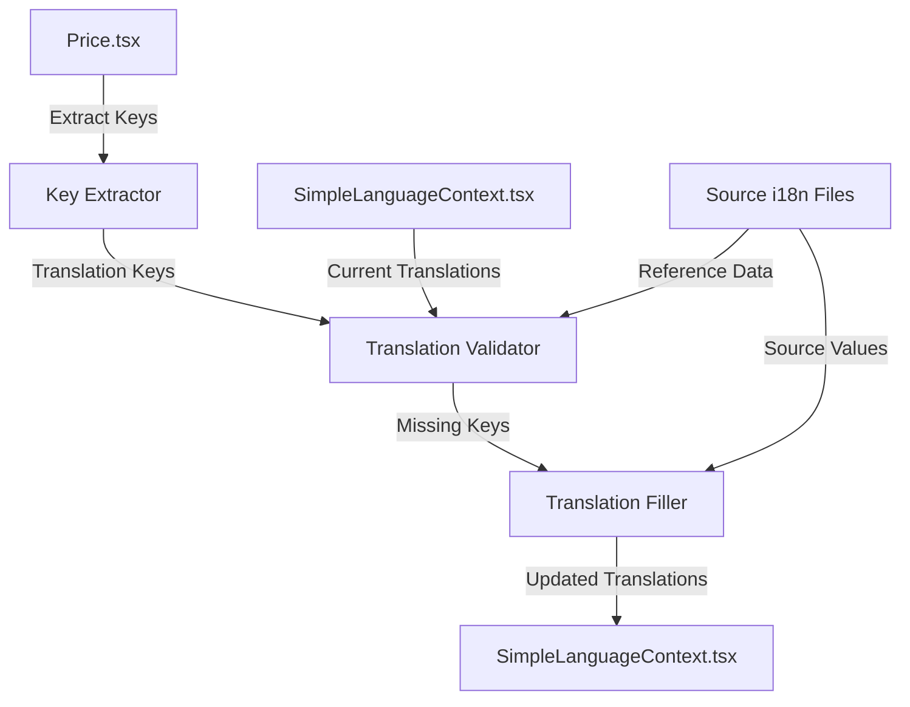

# Design Document: Pricing Page Translation Completion

## Overview

This design outlines the technical approach for verifying and completing translation values for the pricing page in the AGRIBEACON project. The task involves extracting translation keys used in `Price.tsx`, comparing them against the translation values in `SimpleLanguageContext.tsx`, and filling missing values from the source project (`agribeacon-pricing-builder`).

The solution is a one-time data migration/verification task rather than a runtime feature, focusing on ensuring translation completeness across three languages: Vietnamese (vi), English (en), and Japanese (ja).

## Architecture

### System Components



### Data Flow

1. **Key Extraction**: Parse `Price.tsx` to identify all translation keys accessed via `t()` function
2. **Validation**: Compare extracted keys against existing translations in `SimpleLanguageContext.tsx`
3. **Gap Analysis**: Identify missing or undefined values for each language (vi, en, ja)
4. **Value Retrieval**: Extract corresponding values from source project translation files
5. **Integration**: Update `SimpleLanguageContext.tsx` with complete translation data

## Components and Interfaces

### Translation Key Extractor

**Purpose**: Extract all translation keys used in Price.tsx

**Input**: Price.tsx file content
**Output**: Set of translation keys

**Key Patterns to Extract**:
- Direct string literals: `t("hero.badge")`
- Template literals: `t(\`plans.${key}.name\`)`
- Dynamic keys: `t(\`plans.${key}.features\`)`
- Nested object access: `t("faq.items")` (array type)

### Translation Validator

**Purpose**: Verify translation completeness across all languages

**Input**:
- Extracted translation keys
- Current translations from SimpleLanguageContext.tsx
- Source translations from agribeacon-pricing-builder

**Output**: Report of missing/incomplete translations

**Validation Rules**:
1. Every key must exist in all three language objects (vi, en, ja)
2. No value should be `undefined` or empty string
3. Array-type keys must have complete arrays with all items
4. Values must match the semantic meaning from source project

### Translation Filler

**Purpose**: Fill missing translation values from source project

**Input**:
- Missing translation keys
- Source translation files (vi.ts, en.ts, ja.ts)

**Output**: Complete translation object for SimpleLanguageContext.tsx

**Filling Strategy**:
1. Direct key match: Copy value if key exists in source
2. Nested key resolution: Handle dot-notation paths (e.g., "plans.starter.name")
3. Array preservation: Maintain array structure for list-type translations
4. Type consistency: Ensure string vs array types match usage in Price.tsx

## Data Models

### Translation Key Structure

```typescript
interface TranslationKey {
  key: string;              // e.g., "hero.badge"
  type: 'string' | 'array'; // Value type
  usageContext: string;     // Where it's used in Price.tsx
}
```

### Translation Value

```typescript
interface TranslationValue {
  vi: string | string[];
  en: string | string[];
  ja: string | string[];
}
```

### Validation Report

```typescript
interface ValidationReport {
  totalKeys: number;
  missingKeys: {
    vi: string[];
    en: string[];
    ja: string[];
  };
  undefinedValues: {
    vi: string[];
    en: string[];
    ja: string[];
  };
  incompleteArrays: {
    key: string;
    language: 'vi' | 'en' | 'ja';
    expected: number;
    actual: number;
  }[];
}
```

## Correctness Properties

*A property is a characteristic or behavior that should hold true across all valid executions of a system—essentially, a formal statement about what the system should do. Properties serve as the bridge between human-readable specifications and machine-verifiable correctness guarantees.*

### Property 1: Complete Language Coverage

*For any* translation key used in Price.tsx, the Translation_System SHALL provide a non-undefined value in Vietnamese (vi), English (en), and Japanese (ja).

**Validates: Requirements 1.1, 1.2, 1.3, 1.6**

### Property 2: Source Consistency

*For any* translation key that exists in both the source project and target project, the semantic meaning SHALL be preserved across the migration.

**Validates: Requirements 1.4, 1.7**

### Property 3: Array Completeness

*For any* array-type translation key (features, specs, FAQ items), all array elements from the source project SHALL be present in the target Translation_System.

**Validates: Requirements 1.5**

### Property 4: No Undefined Values

*For any* translation key accessed in Price.tsx, calling `t(key)` SHALL NOT return undefined or an empty string.

**Validates: Requirements 1.6**

## Error Handling

### Missing Source Keys

**Scenario**: Translation key used in Price.tsx doesn't exist in source project

**Handling**:
1. Log warning with key name and usage location
2. Check if key exists in current SimpleLanguageContext.tsx
3. If exists, keep current value
4. If doesn't exist, flag for manual review

### Type Mismatches

**Scenario**: Source value type doesn't match expected type in Price.tsx

**Example**: Price.tsx expects array but source has string

**Handling**:
1. Log error with key name and type mismatch details
2. Attempt intelligent conversion (e.g., wrap string in array if appropriate)
3. Flag for manual review if conversion not possible

### Incomplete Arrays

**Scenario**: Array in source has fewer items than expected

**Handling**:
1. Log warning with key name and item count mismatch
2. Use all available items from source
3. Flag for manual completion

## Testing Strategy

### Unit Testing Approach

**Key Extraction Tests**:
- Test extraction of direct string literals from `t()` calls
- Test extraction of template literal keys
- Test extraction of dynamic keys with variables
- Test identification of array-type vs string-type keys

**Validation Tests**:
- Test detection of missing keys in specific languages
- Test detection of undefined values
- Test detection of incomplete arrays
- Test comparison logic between source and target

**Filling Tests**:
- Test correct value retrieval from source files
- Test nested key resolution (dot-notation)
- Test array structure preservation
- Test handling of missing source keys

### Property-Based Testing

**Library**: fast-check (for TypeScript/JavaScript)

**Test Configuration**: Minimum 100 iterations per property test

**Property Test 1: Complete Language Coverage**
```typescript
// Feature: pricing-page-completion, Property 1: Complete Language Coverage
// For any translation key used in Price.tsx, verify all three languages have values
```

**Property Test 2: Source Consistency**
```typescript
// Feature: pricing-page-completion, Property 2: Source Consistency
// For any key in both projects, verify semantic meaning is preserved
```

**Property Test 3: Array Completeness**
```typescript
// Feature: pricing-page-completion, Property 3: Array Completeness
// For any array-type key, verify all elements are present
```

**Property Test 4: No Undefined Values**
```typescript
// Feature: pricing-page-completion, Property 4: No Undefined Values
// For any key accessed in Price.tsx, verify t(key) returns defined value
```

### Integration Testing

**End-to-End Verification**:
1. Run Price.tsx in development mode
2. Switch between all three languages (vi, en, ja)
3. Verify no "undefined" text appears on the page
4. Verify all arrays render completely (features lists, FAQ items, etc.)
5. Verify text content matches source project semantically

### Manual Verification

**Visual Inspection**:
- Compare rendered pricing page with source project
- Verify translation quality and consistency
- Check for any layout issues caused by text length differences
- Verify array items display correctly

## Implementation Notes

### File Locations

**Source Files**:
- `agribeacon-pricing-builder/src/i18n/vi.ts`
- `agribeacon-pricing-builder/src/i18n/en.ts`
- `agribeacon-pricing-builder/src/i18n/ja.ts`

**Target File**:
- `AGRIBEACON/src/contexts/SimpleLanguageContext.tsx`

**Reference File**:
- `AGRIBEACON/src/pages/Price.tsx`

### Key Extraction Strategy

The Price.tsx file uses several patterns for accessing translations:

1. **Direct keys**: `t("hero.badge")`
2. **Template literals**: `t(\`plans.${key}.name\`)`
3. **Array access**: `t("faq.items") as any` then array iteration
4. **Nested objects**: `t(\`plans.${key}.features\`)` expecting array

### Translation Structure Differences

**Source Project Structure** (agribeacon-pricing-builder):
- Organized as nested objects exported as default
- Uses consistent dot-notation for all keys
- Arrays are defined inline

**Target Project Structure** (AGRIBEACON):
- Flat object with dot-notation string keys
- Mixed string and array values
- Larger file with multiple page translations

### Migration Approach

1. **Extract all pricing-related keys** from source files
2. **Map to target structure** (flat dot-notation)
3. **Preserve existing non-pricing translations** in target
4. **Merge new pricing translations** into target
5. **Validate completeness** across all three languages

## Acceptance Criteria Mapping

| Requirement | Design Component | Validation Method |
|-------------|------------------|-------------------|
| 1.1 - Vietnamese values | Translation Filler | Property Test 1 |
| 1.2 - English values | Translation Filler | Property Test 1 |
| 1.3 - Japanese values | Translation Filler | Property Test 1 |
| 1.4 - Fill from source | Translation Filler | Property Test 2 |
| 1.5 - Complete arrays | Translation Validator | Property Test 3 |
| 1.6 - No undefined | Translation Validator | Property Test 4 |
| 1.7 - Match source meaning | Translation Filler | Manual verification |

## Deliverables

1. **Updated SimpleLanguageContext.tsx** with complete pricing translations
2. **Validation Report** documenting all changes made
3. **Test Suite** verifying translation completeness
4. **Documentation** of any manual review items

## Success Criteria

- All translation keys used in Price.tsx have values in vi, en, and ja
- No undefined values returned when rendering Price.tsx
- All array-type keys have complete arrays
- Visual inspection confirms correct rendering in all three languages
- All property-based tests pass with 100+ iterations
